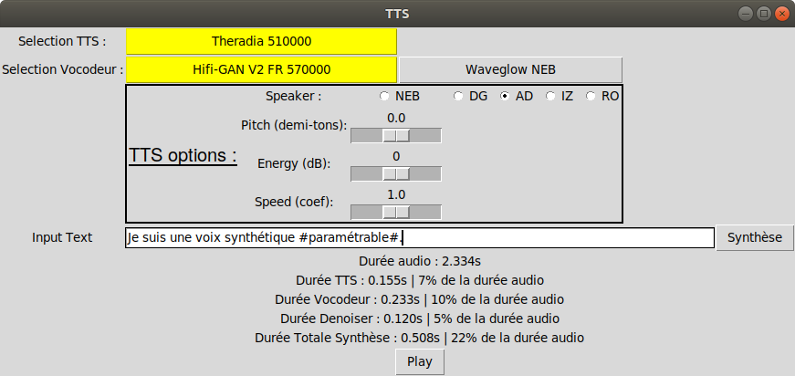

# Interface TTS en temps réel sur CPU (démo)

Cette interface permet de générer des synthèses en temps réel en combinant un TTS et un vocodeur à l'état de l'art. Par défaut, cette interface combine un FastSpeech2 avec Hifi-GAN.

# Installation

L'installation a été testée dans les environnements python 3.8 et 3.10. Le document compressé contient déjà les modèles pré-entrainés. Le fichier de configuration est adapté à ces modèles.

## Dependencies
Le fichier requirements.txt permet d'installer les packages nécessaires.
```
pip3 install -r requirements.txt
```
Il est possible qu'une commande supplémentaire soit nécessaire pour installer les dépendances de l'interfaces graphique.
```
apt-get install python-tk
pip3 install python3-tk
```
# Quickstart

Le fichier de configuration est pré-rempli avec les paramètres recommandés.

## Sans interface graphique

```
python3 do_tts.py
```

Le script charge automatiquement les modèles par défaut FastSpeech2 (voix AD) et Hifi-GAN V2 (Entrainé sur du Français puis fine-tuné sur des spectres multi-locuteurs générés avec FastSpeech2). Lorsque les modèles sont chargés, un champ texte permet de saisir la phrase à synthétiser. Les arguments optionnels --default_tts et --default_vocoder permettent de sélectionner les modèles à pré-charger.

Le modèle accepte des entrées orthographiques et/ou phonétiques. Le signe # ajouté autour d'un mot permet d'ajouter de l'emphase sur celui-ci.
exemple : Bonjour, je suis un avatar #virtuel#.

Attention : pour préciser une entrée phonétique, la segmentation par mot doit être respectée et chaque mot doit être encapsulé dans des accolades.
exemple : Bonjour, je m'appelle {s y z i}.

L'alphabet phonétique utilisé est précisé dans ce [lien](https://zenodo.org/record/4580406#.YuPwJnhByV4).

Note : pour créer un continuité entre les phrases, les modèles sont entrainés avec une ponctuation initiale (exemple : .Bonjour, je m'appelle {s y z i}.). Cependant, pour faciliter la saisie, une ponctuation initiale par défaut est automatiquement ajoutée avant la synthèse. Il n'est donc plus nécessaire de commencer les phrases par une ponctuation. De même, pour faciliter la saisie en conservant une qualité de synthèse optimale, une ponctuation finale est automatiquement ajoutée si la phrase n'en contient pas.

## Avec interface graphique

```
python3 do_tts.py --gui
```

L'argument --gui permet d'utiliser l'interface graphique.



Un TTS et un vocodeur par défaut se chargent à l'ouverture de l'interface (surlignés en jaune). Pour sélectionner un autre TTS ou un autre vocodeur, cliquez sur le bouton correspondant. Le modèle précédente est dé-chargé avant de charger le nouveau (ce processus peut prendre quelques secondes en fonction de la taille des modèles).

En fonction du modèle, des champs supplémentaires apparaissent pour fournir quelques options de contrôle. Plusieurs choix de locuteurs sont disponibles. Des sliders permettent de modifier le pitch, l'énergie ou la vitesse d'élocution du modèle. Pour les modèles expressifs, des boutons radio permettent de choisir le style à appliquer.

Le champ texte permet de saisir le texte à synthétiser. De même, il est possible de combiner entrées orthographiques et/ou phonétiques. Cliquer sur le bouton "Synthèse" ou appuyer sur la touche "Entrée" lance la synthèse de la phrase par le TTS puis le vocodeur. La synthèse est automatiquement jouée quand elle est terminée, et peut être rejouée avec le bouton "Play".

Les durées d'inférence sont affichées automatiquement après la synthèse. 

# Utilisation des balises

Certaines caractères sont automatiquement reconnues pour paramètrer la synthèse.

## Balise de Locuteur : <SPEAKER=*>

La balise \<SPEAKER=* \> permet de spécifier le locuteur avec lequel générer le texte. Cette balise peut être ajouter à n'importe quel emplacement dans la phrase. Si le locuteur précisé par cette balise existe dans le modèle choisi, celui-ci remplacera le locuteur par défaut. Si ce locuteur n'existe pas, la balise n'aura pas d'effet, et le locuteur par défaut sera utilisé. Veuillez à respecter la typographie \<SPEAKER=* \>, sans espace entre < et SPEAKER ni entre SPEAKER et =, et SPEAKER en majuscules.

## Balise de Style : <STYLE=*>

La balise \<STYLE=* \> permet de spécifier le style à employer pour générer le texte. Cette balise peut être ajouter à n'importe quel emplacement dans la phrase. Cette balise n'a d'effet que pour les modèles expressifs. Si le style précisé par cette balise existe dans le modèle choisi, celui-ci remplacera le style par défaut. Si ce style n'existe pas, la balise n'aura pas d'effet, et le style par défaut sera utilisé. Veuillez à respecter la typographie \<STYLE=* \>, sans espace entre < et STYLE ni entre STYLE et =, et STYLE en majuscules.

Le style doit être écrit en majuscules et sans accents. La liste des styles possibles et la suivante :

- COLERE
- DESOLE
- DETERMINE
- ENTHOUSIASTE
- ESPIEGLE
- ETONNE
- EVIDENCE
- INCREDULE
- PENSIF
- RECONFORTANT
- SUPPLIANT
- NARRATION

## Balise fin d'énoncé : §

La balise § fait la séparation entre les sous-énoncés, écrits dans une même entrée textuelle. Quand cette balise est utilisée, le modèle génère séparement les énoncés de part et d'autre de cette balise. Les synthèses (audio et visuelles) sont ensuite concaténées. L'utilisation de cette balise assure un silence d'environ 260ms dans la synthèse.

Il est possible d'utiliser les balises \<SPEAKER=* \> et \<STYLE=* \> dans chaque sous-énoncé. Si une balise est utilisée dans un sous-énoncé, son effet est limité à ce sous-énoncé, et les paramètres par défaut seront appliqués dans les autres sous-énoncés.

L'exemple suivant génère un style différent pour chaque sous-énoncé, avec le locuteur par défaut :

    <STYLE=NARRATION>Bonjour, je suis Suzy, un avatar virtuel expressif.§<STYLE=NARRATION>Vous entendez actuellement ma voix neutre que j'utilise en #narration#.§<STYLE=ENTHOUSIASTE>Je peux aussi être {t r e z} #enthousiaste#, pour exprimer des félicitations.§<STYLE=PENSIF>Ou prendre un air #pensif#~§<STYLE=ETONNE>Je suis parfois #étonné# par ce que l'on me dit?§<STYLE=INCREDULE>Et si je doute~? je serai #incrédule#.§<STYLE=INCREDULE>Oui vraiment?§<STYLE=EVIDENCE>J'exprime parfois l'#évidence# de cette façon.§<STYLE=COLERE>Pour les reproches, je simulerai la #colère#.§<STYLE=ESPIEGLE>Je sais aussi détendre l'atmosphère, avec mon air #espiègle#.§<STYLE=RECONFORTANT>Pour remonter le moral, j'utiliserai un ton #réconfortant#.§<STYLE=DESOLE>Vous êtes triste?, j'en serai #désolé#.§<STYLE=DETERMINE>Je sais aussi être #déterminé#, je vous l'affirme.§<STYLE=SUPPLIANT>Ou #suppliant#, pour demander certaines choses.§

# Post-Traitements

Les paramètres "use_denoiser" et "use_smoothing" dans le fichier "config_tts.yaml" permettent de spécifier l'utilisation d'un post-traitement pour les paramètres audio et visuels respectivement. Ce post-traitement permet de réduire le bruit audio produit par le vocodeur, ainsi que les tressautements de l'avatar.

# Performances

Avec les paramètres recommandés (FastSpeech2 + Hifi-GAN V2), la durée d'inférence est d'environ 20% de la durée d'audio sur CPU.

Les différentes voix de FastSpeech ne modifient par le temps d'inférence. 4 voix de femmes sont disponibles : [NEB, AD, IZ, RO], ainsi qu'une voix d'homme : [DG].

Pour une synthèse audio-visuelle, AD est recommandée.

# Sortie visuelle

Pour le moment, la sortie audio est la seule gérée par l'interface. Cependant, un fichier .AU est généré avec les 37 paramètres visuels (échantillonnés à ~86Hz = 22050/256). Ce fichier garde le format utilisé jusqu'à maintenant (4 entiers 32 bits en entête pour préciser le nombre d'échantillons, le nombre de paramètres visuels, le numérateur de la fréquence d'échantillonnage et le dénominateur de la fréquence d'échantillonnage, suivis par la matrice des paramètres). Ce fichier peut être utilisé pour générer les mouvements de l'avatar.

Les fichiers .wav et .AU sont créés à la racine de ce dossier, avec les noms "audio_file.wav" et "audio_file.AU"